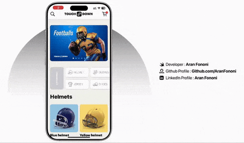
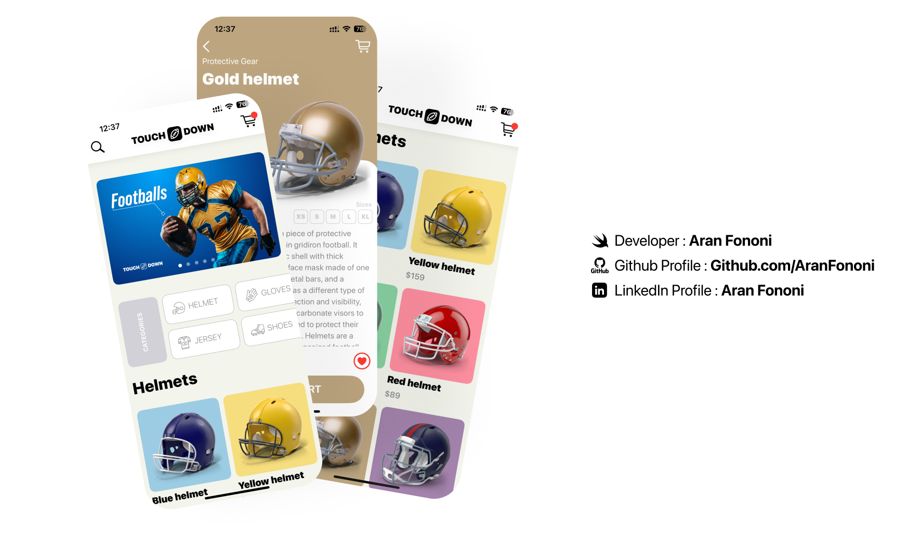

# 🏈 Touchdown – SwiftUI E-commerce App

Touchdown is a modern E-commerce app prototype built entirely with SwiftUI.  
This project is part of the SwiftUI Masterclass course on Udemy and focuses on building a clean, responsive shopping UI while learning essential SwiftUI features and patterns.

The app displays a grid of sports gear products, allows users to view item details, and is designed to adapt to all iPhone screen sizes.  
It includes a custom navigation bar, custom shapes, and dynamic UI elements to match real-world app design standards.

This project helped me better understand how to structure a scalable SwiftUI app and how to manage shared data across multiple views.  
It also gave me the skills and confidence to start building real online E-commerce apps.

---

## 📸 Preview ( might take few seconds to load )

  

  

---

## 🧩 What I learned

- How to prototype a shopping app with SwiftUI components
- Using `@Environment` for view hierarchy context
- Managing shared data using `@ObservableObject`
- Centralizing constants in a dedicated Swift file
- Drawing custom UI elements with `Shape` and `Path`
- Creating horizontal scrollable grid layouts
- Building a fully custom navigation bar
- Resizing items dynamically in `TabView`
- Making UI responsive across all iPhone sizes and so much more...

---

## 📁 About this section

This chapter focused on building a real-world shopping app layout using SwiftUI.  
It was a hands-on way to learn more advanced layout techniques, data flow, and how to keep the UI clean and flexible.  
Each part of the app was built with attention to structure and reusability, keeping future scalability in mind.

---

This project gave me a strong base to build full E-commerce apps.  
If you have any project or idea in mind, feel free to reach out!

---

## 🛠️ How to Run  
1. Clone this repo.  
2. Open the `.xcodeproj` or `.xcworkspace` file in Xcode.  
3. Run it on a simulator or device with iOS 14+ (or macOS with Catalyst).  

---

## 📬 Contact  
For any questions or feedback, feel free to reach out:  
- **Email**: [aranfononi@gmail.com](mailto:aranfononi@gmail.com)  
- **LinkedIn**: [Aran Fononi](https://www.linkedin.com/in/aran-fononi-18182b265)  
